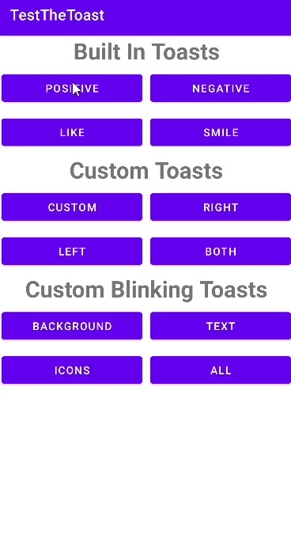

# CustomToast

[](https://jitpack.io/#alonlubinski/CustomToast-Android)
[](https://opensource.org/licenses/Apache-2.0)

A library for simple implementation of fully customizable toast and some built in toasts.<br>
The toast can be designed by changing some attributes like background color, corner radius, text attributes, etc.<br>
Extra feature is a blinking toast - you can decide which part of the toast will blink.

## Setup
Step 1. Add it in your root build.gradle at the end of repositories:
```
allprojects {
    repositories {
	    maven { url 'https://jitpack.io' }
    }
}
```

Step 2. Add the dependency:

```
dependencies {
	implementation 'com.github.alonlubinski:CustomToast-Android:1.00.01'
}
```

## Usage


To display fully customizable toast, you can set the CustomToast attributes as you wish:
```java                    

CustomToast.init()
           .setContext(this)
           .setMessage("Enter your message here")
           .setDuration(CustomToast.LENGTH_SHORT)
           .setBackgroundColor(Color.BLUE)
           .setCornerRadius(50)
           .setTextColor(Color.WHITE)
           .setTextSize(17)
           .setRightIcon(getResources().getDrawable(R.drawable.ic_android))
           .setLeftIcon(getResources().getDrawable(R.drawable.ic_android))
           .buildToast()
           .show();
```
To display fully customizable blinking toast, you can set the blinking attributes as you wish:
```java                    

CustomToast.init()
           .setContext(this)
           .setMessage("Enter your message here")
           .setDuration(CustomToast.LENGTH_SHORT)
           .setBackgroundColor(Color.BLUE)
           .setCornerRadius(50)
           .setTextColor(Color.WHITE)
           .setTextSize(17)
           .setRightIcon(getResources().getDrawable(R.drawable.ic_android))
           .setLeftIcon(getResources().getDrawable(R.drawable.ic_android))
	   .setBackgroundBlink(Color.CYAN, 300)
           .setTextBlink(Color.RED, 200)
           .setIconBlink(Color.WHITE, Color.BLACK, 200)
	   .buildToast()
           .show();
```

To display built in custom toasts:

Positive Toast:
```java                    

CustomToast.init()
	   .positiveToast(this, "This is positive toast!", CustomToast.LENGTH_SHORT, CustomToast.LEFT_IMAGE)
	   .show();
```

Negative Toast:
```java                    

CustomToast.init()
	   .negativeToast(this, "This is negative toast!", CustomToast.LENGTH_SHORT, CustomToast.LEFT_IMAGE)
	   .show();
```

Like Toast:
```java                    

CustomToast.init()
	   .likeToast(this, "This is like toast!", CustomToast.LENGTH_SHORT, CustomToast.LEFT_IMAGE)
	   .show();
```

Smile Toast:
```java                    

CustomToast.init()
	   .smileToast(this, "This is smile toast!", CustomToast.LENGTH_SHORT, CustomToast.LEFT_IMAGE)
	   .show();
```

## License

    Copyright 2020 Alon Lubinski

    Licensed under the Apache License, Version 2.0 (the "License");
    you may not use this file except in compliance with the License.
    You may obtain a copy of the License at

       http://www.apache.org/licenses/LICENSE-2.0

    Unless required by applicable law or agreed to in writing, software
    distributed under the License is distributed on an "AS IS" BASIS,
    WITHOUT WARRANTIES OR CONDITIONS OF ANY KIND, either express or implied.
    See the License for the specific language governing permissions and
    limitations under the License.

